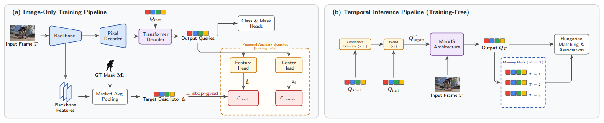

# QueenVIS: Rethinking Image-Only Training for Video Instance Segmentation via Query Enrichment

**Arian Kheirandish**, **Fardin Ayar**, **Ehsan Javanmardi**, **Manabu Tsukada**, **Mahdi Javanmardi**

Official implementation of **QueenVIS**, an image-trained video instance segmentation framework that enriches transformer object queries with appearance and spatial supervision while avoiding video-clip training.

[[`arXiv`](https://arxiv.org/abs/2607.24598)]  | [`Model Zoo`](MODEL_ZOO.md) | [[`Project Page`](https://aut-aisl.github.io/QueenVIS-Project-Page/) | [`BibTeX`](#citation)
        
## Architecture




## Video


## Overview

Most video instance segmentation (VIS) systems learn temporal consistency from annotated video clips. QueenVIS instead trains on individual images only. It strengthens the discriminative power and temporal stability of Mask2Former queries using two auxiliary training objectives:

- **Feature prediction:** regresses each matched object query toward a pooled backbone descriptor of its instance.
- **Center prediction:** injects an explicit spatial prior into each matched query.

Both auxiliary heads are removed after training. During video inference, QueenVIS uses confidence-guided query propagation and a non-parametric memory bank for cross-frame association.

## Main results

The following AP values are those reported in the QueenVIS manuscript. Checkpoint links will be added to the [Model Zoo](MODEL_ZOO.md) when the models are released.

| Backbone | OVIS AP | YouTube-VIS 2019 AP | YouTube-VIS 2021 AP |
|---|---:|---:|---:|
| ResNet-50 | 29.8 | 51.8 | 50.9 |
| Swin-L | 41.0 | 63.2 | 59.8 |

## Installation

See [INSTALL.md](INSTALL.md) for dependencies, Detectron2 setup, and compilation of the MSDeformAttn CUDA operator.

## Dataset preparation

Follow [datasets/README.md](datasets/README.md) to prepare YouTube-VIS 2019/2021 and OVIS. Dataset licenses and terms remain with their respective owners.

## Usage

See [GETTING_STARTED.md](GETTING_STARTED.md) for the complete training, evaluation, configuration, and visualization instructions.

## Model Zoo

The [QueenVIS Model Zoo](MODEL_ZOO.md) contains placeholders for the official 100%-data, image-trained checkpoints. Model and log URLs will be filled in after release.

## Repository structure

```text
configs/             QueenVIS training and evaluation configurations
datasets/            Dataset preparation instructions
demo_video/          Video visualization scripts
mask2former/         Mask2Former-derived image segmentation components
mask2former_video/   Video inference and matching components
queenvis/            QueenVIS query enrichment and inference implementation
train_net_video.py   Main training/evaluation entry point
```

## License and attribution

QueenVIS is a derivative of [MinVIS](https://github.com/NVlabs/MinVIS). Accordingly, unless a file explicitly states otherwise, this repository remains distributed under the [NVIDIA Source Code License-NC](LICENSE), including its **non-commercial research/evaluation-only restriction**. QueenVIS copyright notices identify the authors' modifications and do not remove or replace upstream copyright or license terms.

Some files or components have additional upstream terms, including Apache-2.0, MIT, and BSD-2-Clause terms. See [NOTICE](NOTICE), [THIRD_PARTY_LICENSES.md](THIRD_PARTY_LICENSES.md), and the preserved per-file headers before redistributing or reusing code.

Checkpoint release terms will be stated when checkpoints are published.

<a id="citation"></a>

## Citation

If you use QueenVIS, please cite the paper:

```bibtex
@misc{kheirandish2026queenvisrethinkingimageonlytraining,
      title={QueenVIS: Rethinking Image-Only Training for Video Instance Segmentation via Query Enrichment}, 
      author={Arian Kheirandish and Fardin Ayar and Ehsan Javanmardi and Manabu Tsukada and Mahdi Javanmardi},
      year={2026},
      eprint={2607.24598},
      archivePrefix={arXiv},
      primaryClass={cs.CV},
      url={https://arxiv.org/abs/2607.24598}, 
}
```

## Acknowledgements

This repository is largely based on [Mask2Former](https://github.com/facebookresearch/Mask2Former), [MinVIS](https://github.com/NVlabs/MinVIS), [VITA](https://github.com/sukjunhwang/VITA), and [VISAGE](https://github.com/KimHanjung/VISAGE/tree/main). We thank their authors for releasing their work.

The `convert_coco2ytvis.py` utility, data-loading pipeline under `queenvis/data_video/`, and memory-bank implementation in `queenvis/video_maskformer_model.py` contain code adapted from VISAGE under the Apache License 2.0. See [NOTICE](NOTICE) and [THIRD_PARTY_LICENSES.md](THIRD_PARTY_LICENSES.md) for the applicable attribution and license information.
